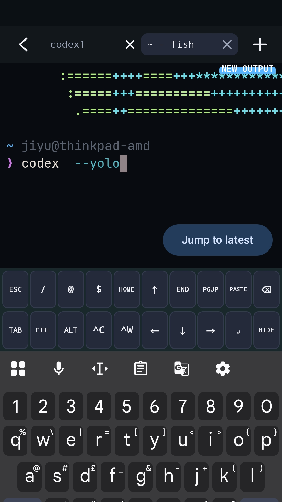
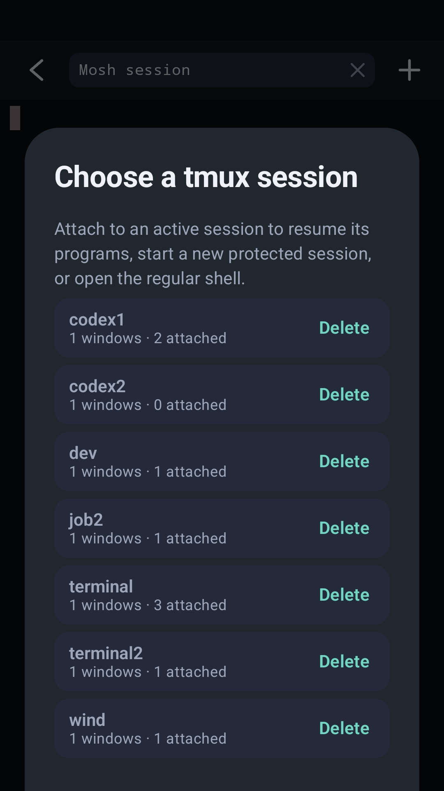

# Terminal Spike

**Your terminal. In your pocket.**

An open-source Android terminal with SSH, built-in Mosh and tabs for your remote sessions.
No ads, analytics or subscriptions. Android 8.0+.

**[Download APK](https://github.com/Anderbone/terminal-spike/releases/download/v0.0.4/terminal-spike-0.0.4.apk)** · **[Get it on Google Play](#google-play-testing)** · [Releases](https://github.com/Anderbone/terminal-spike/releases)

  
  

- **Connect your way:** SSH passwords or keys, plus Mosh in the same app.
- **Keep working:** multiple tabs, tmux session selection and native scrollback.
- **Made for touch:** custom shortcut keys, themes, fonts and SFTP file transfers.
- **Bring your tools:** use remote CLI tools such as Codex on your own server.

## Install and connect

Download the APK above, open it on your phone, and allow installation from your browser when Android asks.
Open Terminal Spike → add a connection → enter your server, username and password or key → connect.
Check the host fingerprint against your server before trusting it. Mosh also needs `mosh-server` on your server.

APK and Google Play signing keys differ. Stick with one installation channel for updates;
switching may require exporting a backup and reinstalling.

## Google Play testing

Use **the same Google account** for all three steps:

1. [Join the tester group](https://groups.google.com/g/terminal-spike-testers).
2. [Become a tester](https://play.google.com/apps/testing/com.yanjiyu.terminalspike).
3. [Install from Google Play](https://play.google.com/store/apps/details?id=com.yanjiyu.terminalspike).

This is an early test release. Found a bug? [Open an issue](https://github.com/Anderbone/terminal-spike/issues) with your Android version and steps to reproduce it.

[Build & contribute](docs/DEVELOPING.md) · [Security](SECURITY.md) · [Licence](LICENSING.md)

GPL-3.0-or-later; component licences and credits are in [Third-party notices](THIRD_PARTY_NOTICES.md).
Terminal Spike is not affiliated with the Mosh project.
